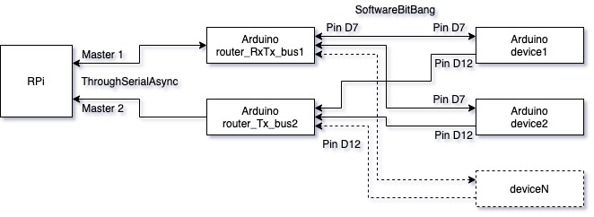

# Two routers

This is the best setup for good stability and performance when need transmit-receive messages from RPi to remote devices AND periodically receive messages from devices to RPi (for example from temperature sensors). Required two separate physical busses, one for transmit-receive messages, another one for only receiving messages.

 

Video: [https://youtu.be/R4MZhWncfPs](https://youtu.be/R4MZhWncfPs)

[router_RxTx_busA](router_RxTx_busA) - sketch for Arduino router which allow RPi communicate with devices (transmit-receive) connected to one PJON bus

[router_Tx_busB](router_Tx_busB) - sketch for Arduino router which allow RPi receive messages from devices connected to another one physical bus

[device](device) - sketche for Arduino device which connected to Arduino routers via [SoftwareBitBang](https://github.com/gioblu/PJON/tree/master/src/strategies/SoftwareBitBang) strategy

**Notes:**
- for each router should be runned separate [PJON gRPC Server](../../../server)
- examples compatible with [PJON v13.0](https://github.com/gioblu/PJON/tree/13.0) and [PJON-gRPC v4.0](https://github.com/Halytskyi/PJON-gRPC/tree/4.0)
